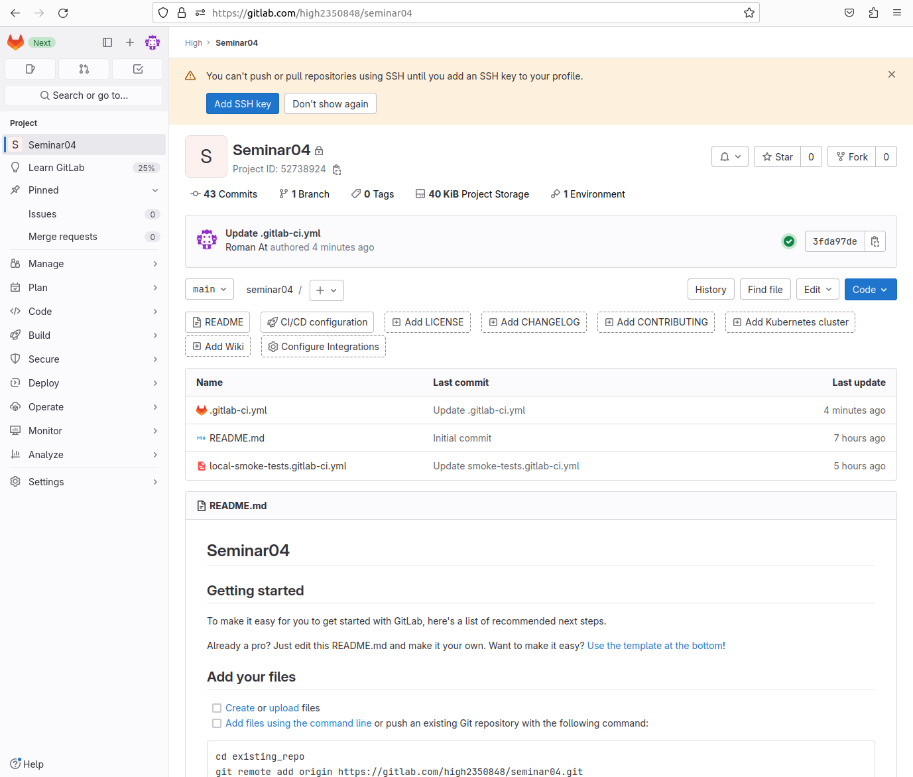
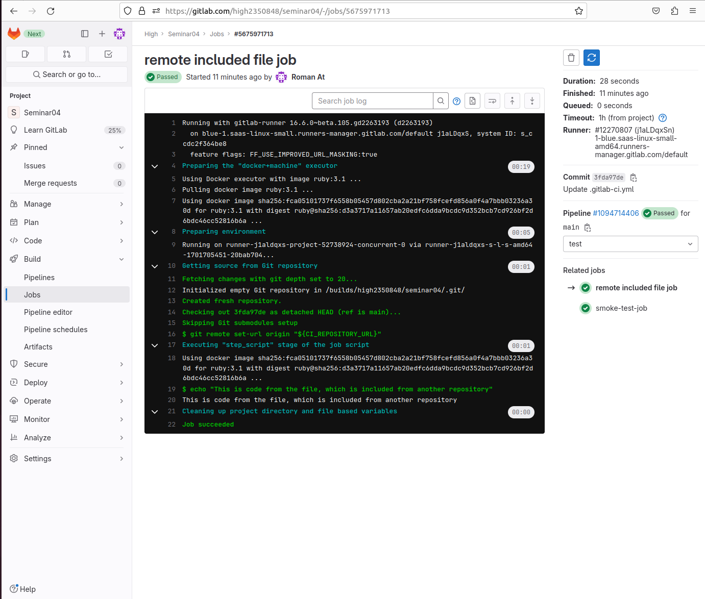
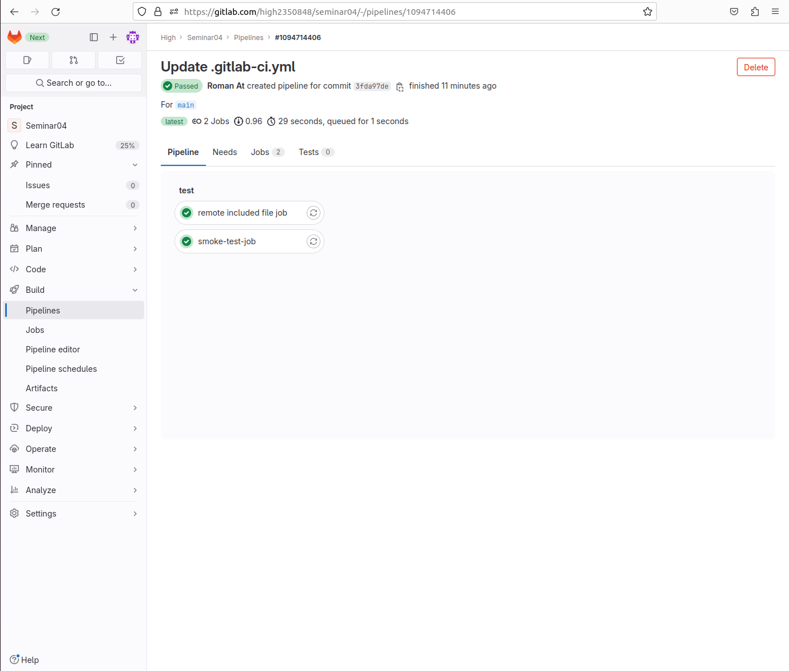

# CI/CD. Семинар 04. Troubleshooting 

## Task
Сделать локальный шаблон CI и отдельный репозиторий с шаблонами, подключить их к своему основному репозиторию через include

(к сожалению подключить внутри репозитория так и не удалось,
пришлось воспользоваться помощью коллег, которые объяснили, как
это сделать через удалённый репозиторий...)

Тем не менее ещё удалось сделать с шаблоном предложенным самим гитлабом
по их документации https://docs.gitlab.com/ee/ci/yaml/includes.html

## Solution

Создан основной файл конфигурации `.gitlab-ci.yml`

```yaml
include:
  - local: local-smoke-tests.gitlab-ci.yml
  
  - remote: https://gitlab.com/ci-cd7655047/5/-/raw/main/remote-included-file.yml
```

Repository Seminar04


Remote included file job


Pipeline passed
